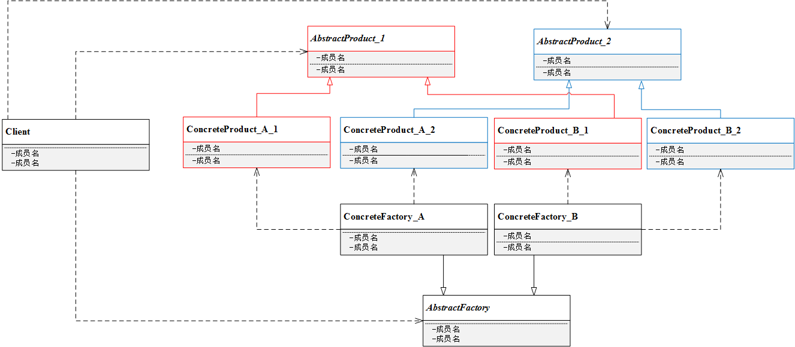
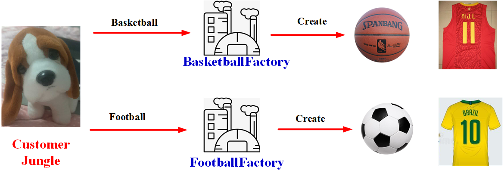
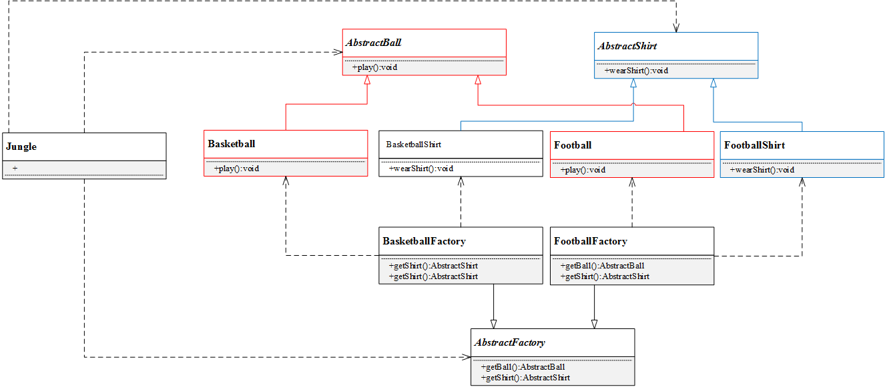
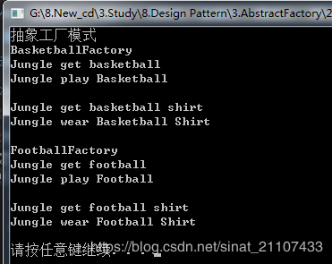

#<center>（六）抽象工厂模式</center>
<font color="red">**核心问题：工厂方法模式中，只有一类产品，如果产品类比较多，就用抽象工厂。**</font>
回顾之前的设计模式，简单工厂模式所有逻辑都封装在工厂类中，工厂根据客户提供的产品名字创建对应产品的对象实例；工厂方法模式将产品的创建过程放到了具体工厂类中，每一个工厂可以创建一个具体产品，由此可能会创建许多工厂类。很多时候，**一个工厂不只是生产一种产品，而是生产一类产品**，比如一个体育用品工厂，可以生产篮球、足球、排球等多种产品。**此时我们可以把这些相关的产品归纳为一个“产品族”，由同一个工厂来生产**，这即是Jungle今天要学习的抽象工厂模式。

# 1.抽象工厂模式简介
抽象工厂模式是常用的创建型设计模式之一。**而今天Jungle要学习的抽象工厂模式，其抽象程度更高，每一个具体工厂可以生产一组相关的具体产品对象。**

抽象工厂模式定义：

> **抽象工厂模式：
> 提供一个创建一系列相关或相互依赖对象的接口，而无需指定他们具体的**类。

简言之，一个工厂可以提供创建多种相关产品的接口，而无需像工厂方法一样，为每一个产品都提供一个具体工厂。 

# 2.抽象工厂模式结构
抽象工厂模式结构与工厂方法模式结构类似，不同之处在于，一个具体工厂可以生产多种同类相关的产品：

* **抽象工厂（AbstractFactory）**：所有生产具体产品的工厂类的基类，提供工厂类的公共方法；
* **具体工厂（ConcreteFactory）**：生产具体的产品
* **抽象产品（AbstractProduct）**：所有产品的基类，提供产品类的公共方法
* **具体产品（ConcreteProduct）**：具体的产品类
抽象工厂模式UML类图如下：



结合抽象工厂模式定义和UML，可以看到具体工厂ConcreteFactory_A可以生产两种产品，分别是ConcreteProduct_A_1和ConcreteProduct_A_2，另一个具体工厂ConcreteFactory_B同理。客户端使用时，需要声明一个抽象工厂**AbstractFactory**和两个抽象产品**AbstractProduct**。

# 3.抽象工厂模式代码实例
考虑这样一个场景，如下图：


> Jungle想要进行户外运动，它可以选择打篮球和踢足球。但这次Jungle不想弄脏原本穿的T恤，所以Jungle还需要穿球衣，打篮球就穿篮球衣，踢足球就穿足球衣。**篮球保管室可以提供篮球和篮球衣，足球保管室可以提供足球和足球衣。**Jungle只要根据心情去某个保管室，就可以换上球衣、拿上球，然后就可以愉快地玩耍了。


 对应的UML实例图如下图：



## 3.1.定义产品类
### 3.1.1.产品类Ball
* 抽象产品类AbstractBall, 球类的基类，定义抽象方法play

```cpp
//抽象产品类AbstractBall
class AbstractBall
{
public:
	AbstractBall(){}
	//抽象方法：
	void play(){};
};
```
* 具体产品类， 分别为Basketball和Football，具体实现方法play

```cpp
//具体产品类Basketball
class Basketball :public AbstractBall
{
public:
	Basketball(){
		play();
	}
	//具体实现方法
	void play(){
		printf("Jungle play Basketball\n\n");
	}
};
//具体产品类Football
class Football :public AbstractBall
{
public:
	Football(){
		play();
	}
	//具体实现方法
	void play(){
		printf("Jungle play Football\n\n");
	}
};
```
###  3.1.2.产品类Shirt
* 抽象产品类AbstractShirt：球衣类的基类，定义抽象方法wearShirt

```cpp
//抽象产品类AbstractShirt
class AbstractShirt
{
public:
	AbstractShirt(){}
	//抽象方法：
	void wearShirt(){};
};
```
* 具体产品类BasketballShirt和FootballShirt，具体实现方法wearShirt

```cpp
//具体产品类BasketballShirt
class BasketballShirt :public AbstractShirt
{
public:
	BasketballShirt(){
		wearShirt();
	}
	//具体实现方法
	void wearShirt(){
		printf("Jungle wear Basketball Shirt\n\n");
	}
};
 
//具体产品类FootballShirt
class FootballShirt :public AbstractShirt
{
public:
	FootballShirt(){
		wearShirt();
	}
	//具体实现方法
	void wearShirt(){
		printf("Jungle wear Football Shirt\n\n");
	}
};
```
## 3.2.定义工厂类
* 定义抽象工厂AbstractFactory，声明两个方法getBall和getShirt

```cpp
//抽象工厂类
class AbstractFactory
{
public:
	virtual AbstractBall *getBall() = 0;
	virtual AbstractShirt *getShirt() = 0;
};
```
* 定义具体工厂BasketballFactory和FootballFactory，重新具体实现两个方法getBall和getShirt

```cpp
//具体工厂类BasketballFactory
class BasketballFactory :public AbstractFactory
{
public:
	BasketballFactory(){
		printf("BasketballFactory\n");
	}
	AbstractBall *getBall(){
		printf("Jungle get basketball\n");
		return new Basketball();
	}
	AbstractShirt *getShirt(){
		printf("Jungle get basketball shirt\n");
		return new BasketballShirt();
	}
};
 
//具体工厂类BasketballFactory
class FootballFactory :public AbstractFactory
{
public:
	FootballFactory(){
		printf("FootballFactory\n");
	}
	AbstractBall *getBall(){
		printf("Jungle get football\n");
		return new Football();
	}
	AbstractShirt *getShirt(){
		printf("Jungle get football shirt\n");
		return new FootballShirt();
	}
};
```

## 3.3.客户端使用方法示例

```cpp
#include <iostream>
#include "AbstractFactory.h"
 
int main()
{
	printf("抽象工厂模式\n");
	
	//定义工厂类对象和产品类对象
	AbstractFactory *fac = NULL;
	AbstractBall *ball = NULL;
	AbstractShirt *shirt = NULL;
 
	fac = new BasketballFactory();
	ball = fac->getBall();
	shirt = fac->getShirt();
 
	fac = new FootballFactory();
	ball = fac->getBall();
	shirt = fac->getShirt();
 
	system("pause");
	return 0;
}
```

## 3.4.效果


# 4.抽象工厂模式总结
抽象工厂模式中，如果需要新增加一个系列的产品，比如足球系列，只需增加一族新的具体产品类（抽象和具体）并提供一个对应的工厂类即可。但是，**如果要在已有的产品族里增加另一个产品，比如Jungle打篮球，除了需要篮球和篮球衣外，<font color="red">Jungle还想换双篮球鞋</font>，这时候该怎么办呢？是不是要去修改BasketballFactory呢？**由此，Jungle总结了抽象工厂模式的特点：

**优点：**

* 工厂方法用于创建客户所需产品，同时向客户隐藏某个	具体产品类将被实例化的细节，用户只需关心所需产品对应的工厂；
* 新加入产品系列时，无需修改原有系统，增强了系统的可扩展性，符合开闭原则。
**缺点：**

* 在已有产品系列中添加新产品时需要修改抽象层代码，对原有系统改动较大，违背开闭原则
**适用环境：**

* 一系列/一族产品需要被同时使用时，适合使用抽象工厂模式；
* 产品结构稳定，设计完成之后不会向系统中新增或剔除某个产品
