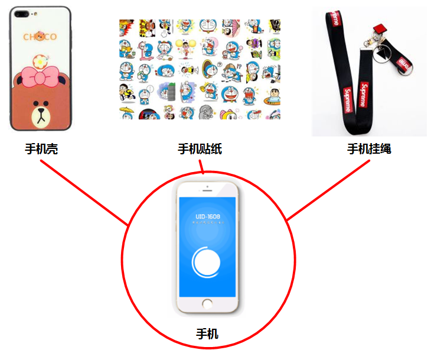
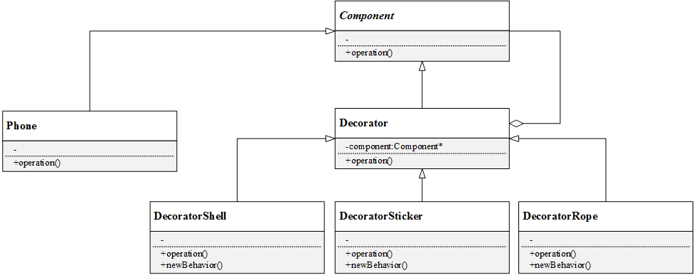

#<center>（十三）装饰模式</center>

人靠衣装，美靠靓装——装饰模式，教你成为最靓的仔！

> 成都的气温说降就降啊！还没立冬呢，温度骤然下降，只有10度了。扛不住了，Jungle要穿一件毛衣！
> 
> 额，出门还是很冷！那再带个围巾！
> 
> 天，上半身不冷了，下半身还那么冷~~~穿上秋裤！
> 
> 出门前想了想，这种天气骑摩拜单车一定吹着手冷，于是Jungle又带上了手套……
> 
> 看到了吗，天冷了，**Jungle想加什么衣裤即加什么衣裤，各种装饰让Jungle不再感到寒冷。不过，不管Jungle穿再多衣服，Jungle始终还是那个Jungle**，那个生活在成都的狗子，这一点是不变的！

看到上面的例子了吗？这就是装饰模式的典型应用，**穿戴再多服饰并不会改变Jungle的本质，但穿戴会让Jungle更加温暖和帅气，满足Jungle冷天出行的需求**。在软件设计中，对已有对象的功能进行扩展，以获得更加符合用户需求的对象，使得对象具有更加强大的功能，这就是装饰模式。

# 1.装饰模式简介
装饰模式可以在不改变一个对象本身功能的基础上给对象增加额外的新行为，比如手机，为防止摔坏，可以给手机贴膜或者带上保护套；为美观，可以在保护套上贴卡通贴纸；为便于携带可以增加挂绳，如下图。但这并不改变手机的本质。



> **装饰模式：
> 动态地给一个对象增加一些额外的职责。就扩展功能而言，装饰模式提供了一种比使用子类更加灵活的替代方案。 **

 装饰模式是一种用于替代继承的技术。通过一种无须定义子类的方式给对象动态增加职责，使用对象之间的关联关系取代类之间的继承关系。装饰模式中引入了装饰类，在装饰类中既可以调用待装饰的原有对象的方法，还可以增加新的方法，以扩充原有类的功能。

# 2.装饰模式结构
装饰模式的结构如图所示：


装饰模式中有如下角色：

* **Component（抽象构件）**：是具体构件类和装饰类的共同基类，声明了在具体构件中定义的方法，客户端可以一致的对待使用装饰前后的对象；
* **ConcreteComponent（具体构件）**：具体构件定义了构件具体的方法，装饰类可以给它增加更多的功能；
* **Decorator（抽象装饰类）**：用于给具体构件增加职责，但具体职责在其子类中实现。抽象装饰类通过聚合关系定义一个抽象构件的对象，通过该对象可以调用装饰之前构件的方法，并通过其子类扩展该方法，达到装饰的目的；
* **ConcreteDecorator（具体装饰类）**： 向构件增加新的功能。

以上面提到的手机为例，手机就是一个具体构件，而手机壳、手机贴纸和手机挂绳，都是具体的装饰类。以Jungle在冷天出门前精心打扮为例，Jungle本人是一个具体构件对象，各类衣裤围巾手套都是具体的装饰类对象。

# 3.装饰模式代码实例
本节以给手机带上手机壳、贴上手机贴纸、系上手机挂绳为例，展示装饰模式的代码。该例的UML图如下所示：



## 3.1.抽象构件类

```cpp
//抽象构件
class Component
{
public:
	Component(){}
	virtual void operation() = 0;
};
```
## 3.2.具体构件类

```cpp
//具体构件类
class Phone :public Component
{
public:
	Phone(){}
	void operation(){
		printf("手机\n");
	}
};
```
## 3.3.装饰类
### 3.3.1.抽象装饰类

```cpp
//抽象装饰类
class Decorator :public Component
{
public:
	Decorator(){}
	Decorator(Component *c){
		this->component = c;
	}
	void operation(){
		this->component->operation();
	}
	Component *getComponent(){
		return this->component;
	}
	void setComponent(Component *c){
		this->component = c;
	}
private:
	Component *component;
};
```
抽象装饰类中有一个成员对象component，以及setter和getter方法。 

### 3.3.2.具体装饰类
具体装饰类一共有三个，分别是手机壳装饰类DecoratorShell、贴纸装饰类DecoratorSticker和挂绳装饰类DecoratorRope。每一个具体装饰类都增加了各自新的职责newBehavior。

```cpp
//具体装饰类：手机壳
class DecoratorShell:public Decorator
{
public:
	DecoratorShell(){}
	DecoratorShell(Component *c){
		this->setComponent(c);
	}
	void operation(){
		this->getComponent()->operation();
		this->newBehavior();
	}
	void newBehavior(){
		printf("装手机壳\n");
	}
};
 
//具体装饰类：手机贴纸
class DecoratorSticker :public Decorator
{
public:
	DecoratorSticker(){}
	DecoratorSticker(Component *c){
		this->setComponent(c);
	}
	void operation(){
		this->getComponent()->operation();
		this->newBehavior();
	}
	void newBehavior(){
		printf("贴卡通贴纸\n");
	}
};
 
//具体装饰类：手机挂绳
class DecoratorRope :public Decorator
{
public:
	DecoratorRope(){}
	DecoratorRope(Component *c){
		this->setComponent(c);
	}
	void operation(){
		this->getComponent()->operation();
		this->newBehavior();
	}
	void newBehavior(){
		printf("系手机挂绳\n");
	}
};
```

## 3.4.客户端代码示例
客户端展示了三段代码，分别为三个手机配上不同的装饰：

```cpp
#include <iostream>
#include "DecoratorPattern.h"
 
int main()
{
	printf("\nJungle的第一个手机：\n");
	Component *c;
	Component *com_Shell;
	c = new Phone();
	com_Shell = new DecoratorShell(c);
	com_Shell->operation();
 
	printf("\nJungle的第二个手机：\n");
	Component *c2;
	Component *com_Shell2;
	c2 = new Phone();
	com_Shell2 = new DecoratorShell(c2);
	Component *com_Sticker;
	com_Sticker = new DecoratorSticker(com_Shell2);
	com_Sticker->operation();
 
	printf("\nJungle的第三个手机：\n");
	Component *c3;
	Component *com_Shell3;
	c3 = new Phone();
	com_Shell3 = new DecoratorShell(c3);
	Component *com_Sticker2;
	com_Sticker2 = new DecoratorSticker(com_Shell3);
	Component *com_Rope;
	com_Rope = new DecoratorRope(com_Sticker2);
	com_Rope->operation();
 
	printf("\n\n");
 
	system("pause");
	return 0;
}
```
3.5.效果


由上述代码示例及运行结果可以看到，客户可以根据个人需要，动态增加构件的职责，但并不影响构件最基本的功能，不会修改原有的设计。同时，如果要增加新的职责（装饰），非常容易进行扩展。 

# 4.总结
**优点：**

* 对于扩展一个类的新功能，装饰模式比继承更加灵活；
* 动态扩展一个对象的功能；
* 可以对一个对象进行多次装饰（如上述例子第二个手机和第三个手机）；
* 具体构件类和具体装饰类可以独立变化和扩展，符合开闭原则。

**缺点：**

* 装饰模式中会增加很多小的对象，对象的区别主要在于各种装饰的连接方式不同，而并不是职责不同，大量小对象的产生会占用较多的系统资源；
* 装饰模式比继承模式更灵活，但也更容易出错，更难于排错。

**适用场景：**

* 在不影响其他对象的情况下，给单个对象动态扩展职责；
* 不适宜采用继承的方式进行扩展的时候，可以考虑使用装饰模式。
