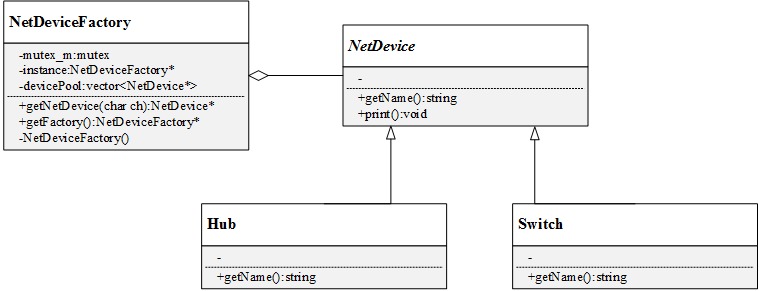

#<center>（十五）享元模式</center>
细粒度对象的大面积复用！——实例分析享元模式

> 知道围棋吗？不会下围棋那总见过吧？四四方方的棋盘上，白色棋子和黑色棋子分布在棋盘的各个位置上。
> 
> 棋子与棋子之间的区别是什么？除了颜色和位置，好像没什么不同了吧！也就是说，每个棋子对象的大部分状态都是一样的（形状、材料、质地等）。如果我们要设计一个程序来实现下围棋的功能，该如何来创建或者表示这上百个棋子对象呢？


类似的，你想输入一段英文段落，无论每个单词再长再复杂，也无非都是由26个字母中的几个组成的。上述两个示例的共同点在于，**整个环境中存在大量相同或者相似的、需要重复使用的对象。**针对这样的场景，面向对象设计中有一类值得借鉴的设计模式是不错的解决方案——享元模式。

# 1.享元模式简介
如果一个系统在运行时创建太多相同或者相似的对象，会占用大量内存和资源，降低系统性能。**享元模式通过共享技术实现相同或相似的细粒度对象的复用，提供一个享元池存储已经创建好的对象，并通过享元工厂类将享元对象提供给客户端使用。
**

> **享元模式：
> 运用共享技术有效地支持大量细粒度对象的复用。**

**享元模式要求被共享的对象必须是细粒度对象**。如上面提到的输入英文段落的例子，26个字母可能随时被客户重复使用。尽管每个字母可能出现的位置不一样，但在物理上它们共享同一个对象（同一个实例）。利用享元模式，可以创建一个存储26个字母对象的享元池，需要时从享元池中取出。


享元对象能够做到共享的关键在于区分了内部状态和外部状态：

* **内部状态**：存储在享元对象内部，不会随着环境的改变而改变的，内部状态可以共享。比如围棋中棋子的形状、大小，不会随着外部变化而变化；比如字母A，无论谁使用，都是A，不会变化；
* **外部状态**：随环境变化而变化、不可以共享的状态，如棋子的位置、颜色，如每个字母的位置。外部状态一般由客户端保存，在使用时再传入到享元对象内部。不同的外部状态之间是相互独立的，棋子A和棋子B的位置可以不同，并且不会相互影响。
# 2.享元模式结构
享元模式常常结合工厂模式一起使用，其结构包含抽象享元类、具体享元类、非共享具体享元类和享元工厂类：

* **Flyweight（抽象享元类）**：是一个抽象类，声明了具体享元类公共的方法，这些方法可以向外部提供享元对象的内部状态数据，也可以通过这些方法设置外部状态；
* **ConcreteFlyweight（具体享元类）**：具体实现抽象享元类声明的方法，具体享元类中为内部状态提供存储空间。具体享元类常常结合单例模式来设计实现，保证每个享元类对象只被创建一次，为每个具体享元类提供唯一的享元对象。
* **UnsharedConcreteFlyweight（非共享具体享元类）**：并不是所有抽象享元类的子类都需要被共享，可以将这些类设计为非共享具体享元类；
* **FlyweightFactory（享元工厂类）**：用于创建并管理享元对象，针对抽象享元类编程，将各种具体享元类对象存储在一个享元池中，享元池一般设计为一个存储键值对的集合（或者其他类型的集合），可结合工厂模式设计。客户需要某个享元对象时，如果享元池中已有该对象实例，则返回该实例，否则创建一个新的实例，给客户返回新的实例，并将新实例保存在享元池中。


# 3.享元模式代码实例
> 很多网络设备都是支持共享的，如交换机（switch）、集线器（hub）等。多台中断计算机可以连接同一台网络设备，并通过网络设备进行数据转发。本节Jungle将使用享元模式来模拟共享网络设备的实例。

本例中，交换机（switch）和集线器（hub）是具体享元对象。UML图如下所示：



## 3.1.抽象享元类

```cpp
// 抽象享元类
class NetDevice
{
public:
	NetDevice(){}
	virtual string getName() = 0;
 
	void print(){
		printf("NetDevice :%s\n",getName().c_str());
	}
};
```
## 3.2.具体享元类
具体享元类有集线器和交换机，实现了抽象享元类声明的方法。

```cpp
// 具体享元类:集线器
class Hub :public NetDevice
{
public:
	Hub(){}
	string getName(){
		return "集线器";
	}
};
 
// 具体享元类:交换机
class Switch :public NetDevice
{
public:
	Switch(){}
	string getName(){
		return "交换机";
	}
};
```
## 3.3.享元工厂类
享元工厂类采用了单例模式，保证工厂实例的唯一性。采用一个vector作为共享池。

```cpp
// 享元工厂类
class NetDeviceFactory
{
public:
	NetDevice* getNetDevice(char ch){
		if (ch == 'S'){
			return devicePool[1];
		}
		else if (ch == 'H'){
			return devicePool[0];
		}
		else{
			printf("wrong input!\n");
		}
		return NULL;
	}
 
	// 单例模式：返回享元工厂类的唯一实例
	static NetDeviceFactory* getFactory(){
		if (instance == NULL){
			m_mutex.lock();
			if (instance == NULL){
				instance = new NetDeviceFactory();
			}
			m_mutex.unlock();
		}
		return instance;
	}
 
private:
	NetDeviceFactory(){
		Hub *hub = new Hub();
		Switch *switcher = new Switch();
		devicePool.push_back(hub);
		devicePool.push_back(switcher);
	}
	static NetDeviceFactory* instance;
	static std::mutex m_mutex;
 
	// 共享池：用一个vector来表示
	vector<NetDevice*> devicePool;
};
 
NetDeviceFactory* NetDeviceFactory::instance = NULL;
std::mutex NetDeviceFactory::m_mutex;
```
## 3.4.客户端代码示例

```cpp
#include <iostream>
#include "FlyweightPattern.h"
 
int main()
{
	NetDeviceFactory *factory = NetDeviceFactory::getFactory();
 
	NetDevice *device1, *device2, *device3, *device4;
 
	// 客户端1获取一个hub
	device1 = factory->getNetDevice('H');
	device1->print();
	// 客户端2获取一个hub
	device2 = factory->getNetDevice('H');
	device2->print();
	// 判断两个hub是否是同一个
	printf("判断两个hub是否是同一个:\n");
	printf("device1:%p\ndevice2:%p\n", device1, device2);
 
	printf("\n\n\n\n");
	// 客户端3获取一个switch
	device3 = factory->getNetDevice('S');
	device3->print();
	// 客户端4获取一个switch
	device4 = factory->getNetDevice('S');
	device4->print();
	// 判断两个switch是否是同一个
	printf("判断两个switch是否是同一个:\n");
	printf("device3:%p\ndevice4:%p\n", device3, device4);
 
	printf("\n\n");
 
	system("pause");
	return 0;
}
```
客户端代码中，两个客户端分别获取集线器，Jungle打印出两个集线器的地址，来判断是否是同一个对象。同理，对交换机，Jungle也进行类似的判断。 

## 3.5.效果


由测试结果可以看出，两个集线器对象的地址是相同的，说明它们都是同一个实例对象，两个交换机也都指向同一个交换机实例对象。由此说明本例的代码实现了网络设备的共享。 

## 3.6.有外部状态的享元模式
进一步，尽管不同的终端计算机可能会共享同一个集线器（交换机），但是每个计算机接入的端口（port）是不一样的，**端口就是每个享元对象的外部状态。 <font color="red">在享元模式的使用过程中，内部状态可以作为具体享元类的成员对象，而外部状态可以通过外部注入的方式添加到具体享元类中。</font>**

“通过外部注入”，因此，客户端可以通过函数传参的方式将“端口”号注入具体享元类：

```cpp
// 抽象享元类
class NetDevice
{
public:
	NetDevice(){}
	virtual string getName() = 0;
 
	/*void print(){
		printf("NetDevice :%s\n",getName().c_str());
	}*/
	void print(int portNum){
		printf("NetDevice :%s  port: %d\n", getName().c_str(), portNum);
	}
};
```
那么客户端的使用方式将变为：

```cpp
#include <iostream>
#include "FlyweightPattern.h"
 
int main()
{
	NetDeviceFactory *factory = NetDeviceFactory::getFactory();
 
	NetDevice *device1, *device2, *device3, *device4;
 
	// 客户端2获取一个hub
	device1 = factory->getNetDevice('H');
	device1->print(1);
	// 客户端2获取一个hub
	device2 = factory->getNetDevice('H');
	device2->print(2);
	// 判断两个hub是否是同一个
	printf("判断两个hub是否是同一个:\n");
	printf("device1:%p\ndevice2:%p\n", device1, device2);
 
	printf("\n\n\n\n");
	// 客户端3获取一个switch
	device3 = factory->getNetDevice('S');
	device3->print(1);
	// 客户端4获取一个hub
	device4 = factory->getNetDevice('S');
	device4->print(2);
	// 判断两个hub是否是同一个
	printf("判断两个switch是否是同一个:\n");
	printf("device3:%p\ndevice4:%p\n", device3, device4);
 
	printf("\n\n");
 
	system("pause");
	return 0;
}
```
 效果如下：


# 4.总结
**优点：**

* 享元模式通过享元池存储已经创建好的享元对象，实现相同或相似的细粒度对象的复用，大大减少了系统中的对象数量，节约了内存空间，提升了系统性能；
* 享元模式通过内部状态和外部状态的区分，外部状态相互独立，客户端可以根据需求任意使用。

**缺点：**

* 享元模式需要增加逻辑来取分出内部状态和外部状态，增加了编程的复杂度；

**适用环境：**

* 当一个系统中有大量重复使用的相同或相似对象时，使用享元模式可以节约系统资源；
* 对象的大部分状态都可以外部化，可以将这些状态传入对象中。
