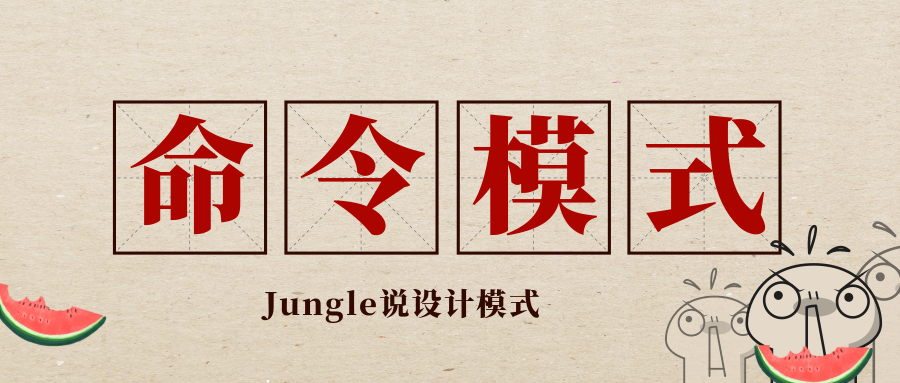
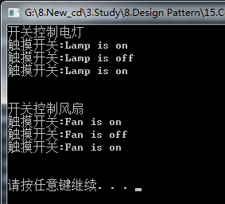

#<center>（十八）命令模式</center>
作为程序员的你，必须要知道命令模式！

> 还记得Jungle曾经设计的Qt图片浏览器吗？鼠标点击“上一张”，浏览上一张图片；点击“下一张”，浏览下一张图片；点击“自动播放”，则自动从上到下播放每一张图片。是不是很有趣的一个小程序？

鼠标点击某个键，就好像用户在向图片浏览器发送指令，图片浏览器内部接收到指令后开始调用相应的函数，最终结果是播放上一张或下一张图片，即执行或响应了用户发出的命令。客户并不知道发出的命令是什么形式，也不知道图片浏览器内部命令是如何执行的；同样，浏览器内部也不知道是谁发送了命令。**命令的发送方和接收方（执行方）没有任何关联**。在软件设计模式中，有一种将命令的发送者与执行者解耦的设计模式——命令模式。



# 1.命令模式简介
命令模式可以将请求（命令）的发送者与接收者完全解耦，发送者与接收者之间没有直接引用关系，发送请求的对象只需要知道如何发送请求，而不必知道请求是如何完成的。下面是比较晦涩难懂的命令模式的定义：

> **命令模式：
> 将一个请求封装为一个对象，从而可用不同的请求对客户进行参数化，对请求排队或者记录请求日志，以及支持可撤销的操作。**

 命令模式的定义比较复杂，也提到一些术语。这些将在下面的阐述和举例中做进一步说明。

# 2.命令模式结构


命令模式的UML结构如上图，命令模式一共有以下几种角色：

* **Command（抽象命令类）**：是一个抽象类，声明了用于执行命令的接口execute()。
* **ConcreteCommand（具体命令类）**：具体的命令类，实现了执行命令的接口execute()，它对应具体的接收者对象，将接收者（Receiver）的动作action()绑定其中。在execu()方法中将调用接收者的动作action()。（<font color="red">这就是定义中的“将请求封装成一个对象”的体现</font>）
* **Invoker（调用者）**：请求的发送者，通过命令对象来执行请求。一个调用者不需要在设计时确定其接收者，所以调用者通过聚合，与命令类产生关联。**具体实现中，可以将一个具体命令对象注入到调用者中，再通过调用具体命令对象的execute()方法，实现简介请求命令执行者（接收者）的操作。**
* **Receiver（接收者）**： 实现处理请求的具体操作（action）。
# 3.命令模式代码实例
房间中的**开关（Button）**就是命令模式的一个实现，本例使用命令模式来模拟开关功能，可控制的对象包括**电灯（Lamp）和风扇（Fan）**。用户每次触摸（touch）开关，都可以打开或者关闭电灯或者电扇。


本实例的UML图如上所示。抽象命令类仅声明execute()接口。有两个具体命令类，分别是控制灯的LampCommand和控制风扇的FanCommand类，两个具体类中实现了execute()接口，即执行开关灯/风扇请求。本例中的调用者是按钮Button，每次用户触摸touch()）开关按钮，即是在发送请求。本例具体设计实现过程如下。

## 3.1.接收者类：电灯和风扇

```cpp
// 接收者：电灯类
class Lamp
{
public :
	Lamp(){
		this->lampState = false;
	}
	void on(){
		lampState = true;
		printf("Lamp is on\n");
	}
	void off(){
		lampState = false;
		printf("Lamp is off\n");
	}
	bool getLampState(){
		return lampState;
	}
private:
	bool lampState;
};
 
// 接收者：风扇类
class Fan
{
public:
	Fan(){
		this->fanState = false;
	}
	void on(){
		fanState = true;
		printf("Fan is on\n");
	}
	void off(){
		fanState = false;
		printf("Fan is off\n");
	}
	bool getFanState(){
		return fanState;
	}
private:
	bool fanState;
};
```
## 3.2.抽象命令类

```cpp
// 抽象命令类 Command
class Command
{
public:
	Command(){}
	// 声明抽象接口：发送命令
	virtual void execute() = 0;
private:
	Command *command;
};
```
## 3.3.具体命令类

```cpp 
// 具体命令类 LampCommand
class LampCommand :public Command
{
public:
	LampCommand(){
		printf("开关控制电灯\n");
		lamp = new Lamp();
	}
	// 实现execute()
	void execute(){
		if (lamp->getLampState()){
			lamp->off();
		}
		else{
			lamp->on();
		}
	}
private:
	Lamp *lamp;
};
 
// 具体命令类 FanCommand
class FanCommand :public Command
{
public:
	FanCommand(){
		printf("开关控制风扇\n");
		fan = new Fan();
	}
	// 实现execute()
	void execute(){
		if (fan->getFanState()){
			fan->off();
		}
		else{
			fan->on();
		}
	}
private:
	Fan *fan;
};
```
## 3.4.调用者：Button

```cpp
// 调用者 Button
class Button
{
public:
	Button(){}
	// 注入具体命令类对象
	void setCommand(Command *cmd){
		this->command = cmd;
	}
	// 发送命令：触摸按钮
	void touch(){
		printf("触摸开关:");
		command->execute();
	}
private:
	Command *command;
};
```
##  3.5.客户端代码示例

```cpp
#include <iostream>
#include "CommandPattern.h"
 
int main()
{
	// 实例化调用者：按钮
	Button *button = new Button();
	Command *lampCmd, *fanCmd;
 
	// 按钮控制电灯
	lampCmd = new LampCommand();
	button->setCommand(lampCmd);
	button->touch();
	button->touch();
	button->touch();
 
	printf("\n\n");
 
	// 按钮控制风扇
	fanCmd = new FanCommand();
	button->setCommand(fanCmd);
	button->touch();
	button->touch();
	button->touch();
 
	printf("\n\n");
	system("pause");
	return 0;
}
```
## 3.6.效果



 可以看到，客户端只需要有一个调用者和抽象命令类，在给调用者注入命令时，再将命令类具体化（**<font color="red">这也就是定义中“可用不同的请求对客户进行参数化”的体现</font>**）。客户端并不知道命令是如何传递和响应，只需发送命令touch()即可，由此实现命令发送者和接收者的解耦。

如果系统中增加了新的功能，功能键与新功能对应，只需增加对应的具体命令类，在新的具体命令类中调用新的功能类的action()方法，然后将该具体命令类通过注入的方式加入到调用者，无需修改原有代码，符合开闭原则。

# 4.命令队列
有时候，当请求发送者发送一个请求时，有不止一个请求接收者产生响应（Qt信号槽，一个信号可以连接多个槽），这些请求接收者将逐个执行业务方法，完成对请求的处理，此时可以用命令队列来实现。**比如按钮开关同时控制电灯和风扇，这个例子中，请求发送者是按钮开关，有两个接收者产生响应，分别是电灯和风扇。**

可以参考的命令队列的实现方式是增加一个命令队列类（CommandQueue）来存储多个命令对象，不同命令对象对应不同的命令接收者。调用者也将面对命令队列类编程，增加注入具体命令队列类对象的方法setCommandQueue(CommandQueue *cmdQueue)。

下面的例子展示了按钮开关请求时，电灯和风扇同时作为请求的接收者。代码如下所示：


```cpp
#ifdef COMMAND_QUEUE
/*************************************/
/*             命令队列              */
#include <vector>
 
// 命令队列类
class CommandQueue
{
public:
	CommandQueue(){
	}
	void addCommand(Command *cmd){
		commandQueue.push_back(cmd);
	}
	void execute(){
		for (int i = 0; i < commandQueue.size(); i++)
		{
			commandQueue[i]->execute();
		}
	}
private:
	vector<Command*>commandQueue;
 
};
 
// 调用者
class Button2
{
public:
	Button2(){}
	// 注入具体命令队列类对象
	void setCommandQueue(CommandQueue *cmdQueue){
		this->cmdQueue = cmdQueue;
	}
	// 发送命令：触摸按钮
	void touch(){
		printf("触摸开关:");
		cmdQueue->execute();
	}
private:
	CommandQueue *cmdQueue;
};
 
#endif
```
 客户端代码如下：

```cpp
#ifdef COMMAND_QUEUE
 
	printf("\n\n***********************************\n");
	Button2 *button2 = new Button2();
	Command *lampCmd2, *fanCmd2;
	CommandQueue *cmdQueue = new CommandQueue();
 
	// 按钮控制电灯
	lampCmd2 = new LampCommand();
	cmdQueue->addCommand(lampCmd2);
 
	// 按钮控制风扇
	fanCmd2 = new FanCommand();
	cmdQueue->addCommand(fanCmd2);
 
	button2->setCommandQueue(cmdQueue);
	button2->touch();
 
#endif
```
效果如下图：


# 5.命令模式其他应用
## 5.1.记录请求日志
将历史请求记录保存在日志里，即请求日志。很多软件系统都提供了日志文件，记录运行过程中的流程。一旦系统发生故障，日志成为了分析问题的关键。日志也可以保存命令队列中的所有命令对象，每执行完一个命令就从日志里删除一个对应的对象。

## 5.2.宏命令
宏命令又叫组合命令，是组合模式和命令模式的结合。宏命令是一个具体命令类，拥有一个命令集合，命令集合中包含了对其他命令对象的引用。宏命令通常不直接与请求者交互，而是通过它的成员来遍历调用接收者的方法。当调用宏命令的execute()方法时，就遍历执行每一个具体命令对象的execute()方法。（类似于前面的命令队列）

# 6.总结
**优点：**

* 降低系统耦合度，将命令的请求者与接收者分离解耦，请求者和发送者不存在直接关联，各自独立互不影响。
* 便于扩展：新的命令很容易加入到系统中，且符合开闭原则。
* 较容易实现命令队列或宏命令。
* 为请求的撤销和回复操作提供了一种设计实现方案。

**缺点：**

* 命令模式可能导致系统中有过多的具体命令类，增加了系统中对象的数量。

**适用环境：**

* 系统需要将请求发送者和接收者解耦，使得发送者和接收者互不影响。
* 系统需要在不同时间指定请求、将请求排队和执行请求。
* 系统需要支持命令的撤销和恢复操作。
* 系统需要将一组操作组合在一起形成宏命令。
