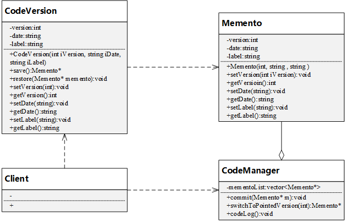
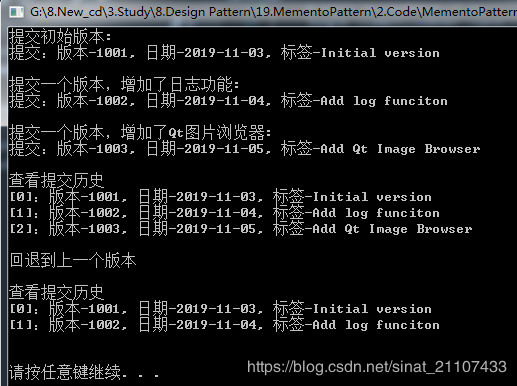

#<center>（二十二）备忘录模式</center>
我用备忘录模式设计了简易的版本控制系统


> “Ctrl+Z”是什么操作？各位都用过，并且经常使用吧？撤销！撤销上一个操作返回上一个状态，甚至撤销好几个操作，返回到几个操作之前的状态。这个操作非常有用，一旦我们某一步操作失误，可以选择撤销操作来返回原来的无错状态。
> 
> 那么系统怎么知道每一步的状态呢？它一定保存了一定数量的历史状态！就像Git版本控制一样，保存着每一次提交的状态，使用者可以随时reset到历史某个状态，**就像一个备忘录一样，保存了某些阶段的状态。**


# 1.备忘录模式简介
类似于上述引言的例子，在软件系统的操作过程中，难免会出现一些不当的操作，使得系统状态出现某些故障。如果能够有一种机制——<font color="red">**能够保存系统每个阶段的状态，当用户操作失误的时候，可以撤销不当的操作，回到历史某个阶段**</font>——那么软件系统将更加灵活和人性化。

有没有这样的一种解决方案呢？有！那就是备忘录模式。备忘录模式提供了一种状态恢复的机制，用户可以方便地回到指定的某个历史状态。很多软件的撤销操作，就使用了备忘录模式。

> **备忘录模式：
> 在不破坏封装的前提下捕获一个对象的内部状态，并在该对象之外保存这个状态，这样可以在以后将对象恢复到原先保存的状态。 **

## 2.备忘录模式结构
备忘录模式的UML图如下所示：


备忘录模式主要有以下角色：

* **Originator（原发器）**：通过创建一个备忘录类存储当前的内部状态，也可以使用备忘录来恢复其内部状态，通常是将系统中需要保存内部状态的类设计为原发器；
* **Memento（备忘录）**：用于存储原发器的内部状态。备忘录的设计可以参考原发器的设计，根据需要确定备忘录类中的属性；**除了原发器类对象，不允许其他对象修改备忘录。**
* **Caretaker（负责人）**：负责保存备忘录，<font color="red">可以存储一个或多个备忘录对象</font>，但是负责人只负责保存对象，不能修改对象，也不必知道对象的实现细节。（<font color="purse">看好了，负责人可以存储多个备忘录对象，想一想这有什么用？是不是可以保存多个历史状态？实现多步撤销操作了</font>）

备忘录模式的关键是备忘录类和负责人类的设计，以下是上述三个角色的典型实现：

```cpp
#ifndef __DEMO_H__
#define __DEMO_H__
 
// 前向声明
class Memento;
 
// 原发器  典型实现
class Originator
{
public:
	Originator(){
		state = "";
	}
	Originator(String iState){
		state = iState;
	}
	// 创建备忘录对象
	Memento* createMemento(){
		return new Memento(this);
	}
	// 利用备忘录对象恢复原发器状态
	void restoreMemento(Memento* m){
		state = m->getState();
	}
	void setState(string iState){ 
		state = iState; 
	}
	string getState(){ 
		return state; 
	}
private:
	string state;
};
 
// 备忘录  典型实现（仿照原生器的设计）
class Memento
{
public:
	Memento(){
		state = "";
	}
	Memento(Originator* o){
		state = o->getState();
	}
	void setState(String iState){
		state = iState;
	}
	string getState(){
		return state;
	}
private:
	String state;
};
 
// 负责人  典型实现
class Caretaker
{
public:
	Caretaker(){}
	Memento* getMemento(){
		return memento;
	}
	void setMemento(Memento *m){
		memento = m;
	}
private:
	Memento* memento;
};
 
// 客户端 示例代码
int main()
{
	// 创建原发器对象
	Originator o = new Originator("状态1");
	// 创建负责人对象
	Caretaker *c = new Caretaker();
	c->setMemento(o->createMemento());
 
	o->setState("状态2");
 
	// 从负责人对象中取出备忘录对象，实现撤销
	o->restoreMemento(c->getMemento());
 
	return 0;
}
 
#endif
```
# 3.备忘录模式代码实例
> Jungle正在为代码版本管理苦恼，有时候为了尝试某个功能就去修改代码，导致原有的健壮的代码被破坏。所以Jungle希望能够设计一个代码保存和版本回退功能的demo，方便代码的管理。

本实例中，原生器为CodeVersion，具有版本号version、提交日期date和标签label三个状态需要备忘录Memento保存；管理者是CodeManager，具有提交代码commit（即保存一个版本）、回退到指定版本switchToPointedVersion（即撤销操作）和查看提交历史codeLog的功能。该实例的UML图如下图，具体代码如下。（完整代码资源见https://github.com/FengJungle/DesignPattern）



## 3.1.备忘录Memento

```cpp
#ifndef __MEMENTO_H__
#define __MEMENTO_H__
 
class Memento
{
public:
	Memento(){}
	Memento(int iVersion, string iDate, string iLabel){
		version = iVersion;
		date = iDate;
		label = iLabel;
	}
	void setVersion(int iVersion){
		version = iVersion;
	}
	int getVersion(){
		return version;
	}
	void setLabel(string iLabel){
		label = iLabel;
	}
	string getLabel(){
		return label;
	}
	void setDate(string iDate){
		date = iDate;
	}
	string getDate(){
		return date;
	}
private:
	int version;
	string date;
	string label;
};
 
#endif
```
## 3.2.原生器CodeVersion

```cpp
#ifndef __CODEVERSION_H__
#define __CODEVERSION_H__
 
#include <iostream>
using namespace std;
 
#include "Memento.h"
 
// 原生器：CodeVersion
class CodeVersion
{
public:
	CodeVersion(){
		version = 0;
		date = "1900-01-01";
		label = "none";
	}
	CodeVersion(int iVersion, string iDate, string iLabel){
		version = iVersion;
		date = iDate;
		label = iLabel;
	}
	// 保存代码
	Memento* save(){
		return new Memento(this->version, this->date, this->label);
	}
	// 回退版本
	void restore(Memento* memento){
		setVersion(memento->getVersion());
		setDate(memento->getDate());
		setLabel(memento->getLabel());
	}
	void setVersion(int iVersion){
		version = iVersion;
	}
	int getVersion(){
		return version;
	}
	void setLabel(string iLabel){
		label = iLabel;
	}
	string getLabel(){
		return label;
	}
	void setDate(string iDate){
		date = iDate;
	}
	string getDate(){
		return date;
	}
private:
	// 代码版本
	int version;
	// 代码提交日期
	string date;
	// 代码标签
	string label;
};
 
#endif
```
## 3.3.管理者CodeManager 

```cpp
#ifndef __CODEMANAGER_H__
#define __CODEMANAGER_H__
 
#include "Memento.h"
#include <vector>
using namespace std;
 
// 管理者
class CodeManager
{
public:
	CodeManager(){}
	void commit(Memento* m){
		printf("提交：版本-%d, 日期-%s, 标签-%s\n", m->getVersion(), m->getDate().c_str(), m->getLabel().c_str());
		mementoList.push_back(m);
	}
	// 切换到指定的版本，即回退到指定版本
	Memento* switchToPointedVersion(int index){
		mementoList.erase(mementoList.begin() + mementoList.size() - index, mementoList.end());
		return mementoList[mementoList.size() - 1];
	}
	// 打印历史版本
	void codeLog(){
		for (int i = 0; i < mementoList.size(); i++){
			printf("[%d]：版本-%d, 日期-%s, 标签-%s\n", i, mementoList[i]->getVersion(),
				mementoList[i]->getDate().c_str(), mementoList[i]->getLabel().c_str());
		}
	}
private:
	vector<Memento*> mementoList;
};
 
#endif
```
## 3.4.客户端代码示例及效果

```cpp
#include "Originator.h"
#include "Memento.h"
#include "CodeManager.h"
 
int main()
{
	CodeManager *Jungle = new CodeManager();
 
	CodeVersion* codeVer = new CodeVersion(1001, "2019-11-03", "Initial version");
 
	// 提交初始版本
	printf("提交初始版本:\n");
	Jungle->commit(codeVer->save());
 
	// 修改一个版本，增加了日志功能
	printf("\n提交一个版本，增加了日志功能:\n");
	codeVer->setVersion(1002);
	codeVer->setDate("2019-11-04");
	codeVer->setLabel("Add log funciton");
	Jungle->commit(codeVer->save());
 
	// 修改一个版本，增加了Qt图片浏览器
	printf("\n提交一个版本，增加了Qt图片浏览器:\n");
	codeVer->setVersion(1003);
	codeVer->setDate("2019-11-05");
	codeVer->setLabel("Add Qt Image Browser");
	Jungle->commit(codeVer->save());
 
	// 查看提交历史
	printf("\n查看提交历史\n");
	Jungle->codeLog();
 
	// 回退到上一个版本
	printf("\n回退到上一个版本\n");
	codeVer->restore(Jungle->switchToPointedVersion(1));
 
	// 查看提交历史
	printf("\n查看提交历史\n");
	Jungle->codeLog();
 
	printf("\n\n");
	system("pause");
	return 0;
}
```
代码运行结果如下：



 这是不是像一个超级简易版本的代码版本控制系统？？？哈哈哈！

# 4.总结
**优点：**

* 实现状态恢复、撤销操作的功能，用户可以恢复到指定的历史状态，让软件系统更加人性化；
* 备忘录封装了信息，除了原生器以外，其他对象访问不了备忘录的代码；

**缺点：**

* 资源消耗大。如果需要保存原生器对象的多个历史状态，那么将创建多个备忘录对象；或者如果原生器对象的很多状态都需要保存，也将消耗大量存储资源。

**适用环境：**

* 保存一个对象的历史状态，系统需要设计回退或者撤销功能；
* 备忘录类可以封装一个对象的历史状态，避免对象的历史状态被外界修改。
