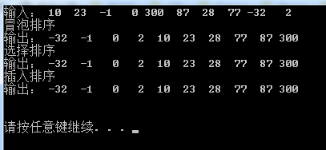

#<center>（二十五）策略模式</center>
如何管理和维护算法族？只需知道策略模式
> 
> 同样是排序算法，你可以选择冒泡排序、选择排序、插入排序、快速排序等等，也即是说，为了实现排序这一个目的，有很多种算法可以选择。这些不同的排序算法构成了一个<font color="red">算法族</font>，你可以在需要的时候，根据需求或者条件限制（内存、复杂度等）适时选择具体的算法。

在面向对象的设计里，该如何设计这样一个算法族呢？它包含了多种算法，在使用的时候又会根据条件来选择具体的算法？这就会用到软件设计模式中的——策略模式。


# 1.策略模式简介
策略模式用于算法的自由切换和扩展，对应于解决某一问题的一个算法族，允许用户从该算法族中任意选择一个算法解决问题，同时还可以方便地更换算法或者增加新的算法。策略模式将算法族中的每一个算法都封装成一个类，每一个类称为一个策略（Strategy）。

> **策略模式：
> 定义一系列算法，将每一个算法封装起来，并让它们可以相互替换。策略模式让算法可以独立于使用它的客户而变化。**

# 2.策略模式结构
为了方便算法族中的不同算法在使用中具有一致性，在策略模式中会提供一个抽象层来声明公共接口，在具体的策略类中实现各个算法。策略模式由上下文类和策略类组成，其UML结构如下图：


* **Context（上下文类）** ：上下文类是使用算法的角色，可以在解决不同具体的问题时实例化不同的具体策略类对象；
* **Strategy（抽象策略类）**：声明算法的方法，抽象层的设计使上下文类可以无差别的调用不同的具体策略的方法；
* **ConcreteStrategy（具体策略类）**：实现具体的算法。

# 3.策略模式代码实例
> 某系统提供了一个用于对数组进行操作的类，该类封装了对数组的常见操作，现以排序操作为例，**使用策略模式设计该数组操作类，使得客户端可以动态更换排序算法，可以根据需要选择冒泡排序或者选择排序或者插入排序，也能够灵活增加新的排序算法** 。

 显然，在该实例中，可以冒泡排序、选择排序和插入排序分别封装为3个具体策略类，它们有共同的基类SortStrategy。还需要一个上下文类Context，Context中维护了一个SortStrategy的指针，在客户端需要的时候，通过Context的setSortStrategy()方法来实例化具体的排序类对象。该实例的UML结构图如下：


## 3.1.排序策略类
### 3.1.1.抽象排序策略类

```cpp
// 抽象策略类
class Strategy
{
public:
	Strategy(){}
	virtual void sort(int arr[], int N) = 0;
};
```
### 3.1.2.具体策略类：冒泡排序类

```cpp
// 具体策略：冒泡排序
class BubbleSort :public Strategy
{
public:
	BubbleSort(){
		printf("冒泡排序\n");
	}
	void sort(int arr[], int N){
		for (int i = 0; i<N; i++)
		{
			for (int j = 0; j<N - i - 1; j++)
			{
				if (arr[j]>arr[j + 1]){
					int tmp = arr[j];
					arr[j] = arr[j + 1];
					arr[j + 1] = tmp;
				}
			}
		}
	}
};
```
###3.1.3.具体策略类：选择排序类

```cpp
// 具体策略：选择排序
class SelectionSort :public Strategy
{
public:
	SelectionSort(){
		printf("选择排序\n");
	}
	void sort(int arr[], int N){
		int i, j, k;
		for (i = 0; i<N; i++)
		{
			k = i;
			for (j = i + 1; j<N; j++)
			{
				if (arr[j] < arr[k]){
					k = j;
				}
			}
			int temp = arr[i];
			arr[i] = arr[k];
			arr[k] = temp;
		}
	}
};
```
###3.1.4.具体策略类：插入排序类

```cpp
// 具体策略：插入排序
class InsertSort :public Strategy
{
public:
	InsertSort(){
		printf("插入排序\n");
	}
	void sort(int arr[], int N){
		int i, j;
		for (i = 1; i<N; i++)
		{
			for (j = i - 1; j >= 0; j--)
			{
				if (arr[i]>arr[j]){
					break;
				}
			}
			int temp = arr[i];
			for (int k = i - 1; k > j; k--){
				arr[k + 1] = arr[k];
			}
			arr[j + 1] = temp;
		}
	}
};
```
##3.2.上下文类

```cpp
#ifndef __CONTEXT_H__
#define __CONTEXT_H__
 
#include "Strategy.h"
#include <stdio.h>
 
// 上下文类
class Context
{
public:
	Context(){
		arr = NULL;
		N = 0;
	}
	Context(int iArr[], int iN){
		this->arr = iArr;
		this->N = iN;
	}
	void setSortStrategy(Strategy* iSortStrategy){
		this->sortStrategy = iSortStrategy;
	}
	void sort(){
		this->sortStrategy->sort(arr, N);
		printf("输出： ");
		this->print();
	}
	void setInput(int iArr[], int iN){
		this->arr = iArr;
		this->N = iN;
	}
	void print(){
		for (int i = 0; i < N; i++){
			printf("%3d ", arr[i]);
		}
		printf("\n");
	}
 
private:
	Strategy* sortStrategy;
	int* arr;
	int N;
};
 
#endif // __CONTEXT_H__
```
##3.3.客户端代码示例及结果

```cpp
#include "Context.h"
#include <stdio.h>
#include <stdlib.h>
 
int main()
{
	Context* ctx = new Context();
	int arr[] = { 10, 23, -1, 0, 300, 87, 28, 77, -32, 2 };
	ctx->setInput(arr, sizeof(arr)/sizeof(int));
	printf("输入：");
	ctx->print();
 
	// 冒泡排序
	ctx->setSortStrategy(new BubbleSort());
	ctx->sort();
 
	// 选择排序
	ctx->setSortStrategy(new SelectionSort());
	ctx->sort();
 
	// 插入排序
	ctx->setSortStrategy(new InsertSort());
	ctx->sort();
 
	printf("\n\n");
	system("pause");
	return 0;
}
```
代码运行结果如下：



从客户端代码可以看到，客户端无需关心具体排序算法的细节，都是统一的调用上下文的sort()接口。另外，如果要增加新的排序算法，比如快速排序QuickSort，只需要从基类SortStrategy在派生一个类QuickSort，在QuickSort类中实现具体的sort()算法即可，扩展起来非常方便。

# 4.总结
**优点**：

* 符合<font color="red">开闭原则</font>，策略模式易于扩展，增加新的算法时只需继承抽象策略类，新设计实现一个具体策略类即可；
* 客户端可以无差别地通过公共接口调用，利用<font color="red">里式替换原则</font>，灵活使用不同的算法策略；
* 提供了一个算法族管理机制和维护机制。

**缺点：**

* 客户端必须要知道所有的策略，以便在使用时按需实例化具体策略；
* 系统会产生很多单独的类，增加系统中类的数量；
* 客户端在同一时间只能使用一种策略。

**适用环境：**

* 系统需要在一个算法族中动态选择一种算法，可以将这些算法封装到多个具体算法类中，这些算法类都有共同的基类，即可以通过一个统一的接口调用任意一个算法，客户端可以使用任意一个算法；
* 不希望客户端知道复杂的、与算法相关的数据结构，在具体策略类中封装与算法相关的数据结构，可以提高算法的安全性。
